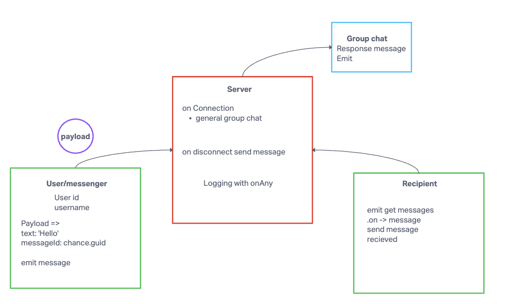

# Chat Hive

## Author: Tricia and Justin

## Problem Domain

Chat application that allows users to communicate and join group chats based on their interests.

## Setup

### Environment Variables

- `PORT` - Port Number
- `DATABASE_URL` - URL to the running Postgres instance/db
- `SECRET` - Secret for jwt tokens

### Initializing and Running the Application

To set up and run the application, follow these steps:

1. Create repository
2. Run `npm install` to install dependencies.
3. Run `npm i chance eslint jest socket.io socket.io-client
4. Run `npm start` or `nodemon` to start the application

### UML Diagram

