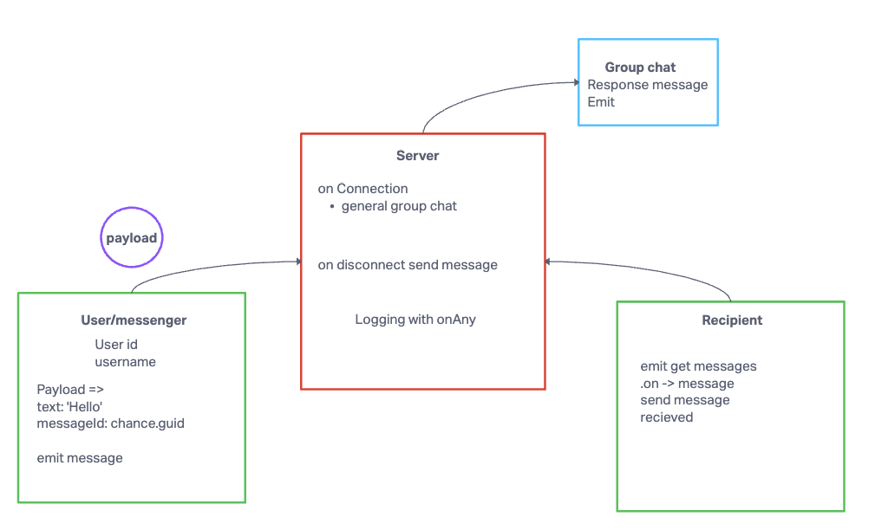

# chat-hive

## Author: Tricia and Justin

## Problem Domain

Chat application that allows users to communicate and join group chats based on their interests.

## Links and Resources

- Code from previous lab, lab 13
- Ryan demo content
- Chat gtp to help build tests
- Help from Stephen in Remo with making sure we have all our emits and listeners

## Setup

### `.env` requirements

- `PORT` - Port Number
- `DATABASE_URL` - URL to the running Postgres instance/db
- `SECRET` - Secret for jwt tokens

### How to initialize/run your application (where applicable)

- Create repo
- Add starter code(from lab 12-13)
- `npm install` to install dependencies.
- `npm i chance eslint jest socket.io socket.io-client

### UML

